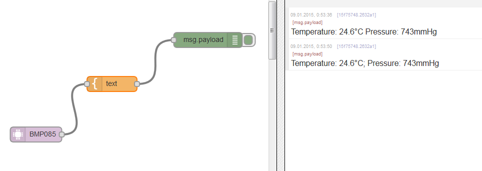

node-red-contrib-bmp085
=====================

A <a href="http://nodered.org" target="_new">Node-RED</a> node to receive data from [Bosch BMP085 barometer sensor](http://www.adafruit.com/products/391) using i2c.

Install
-------

	cd node-red/nodes/
	git clone https://github.com/mrkrasser/node-red-contrib-bmp085.git

Pre-reqs
--------

	npm install bmp085	

For Raspberry Pi users: enable i2c on your Pi and add pi user to i2c group

Usage
-----

Node sends message with temperature and pressure when receive input message.
Outputs an object called <b>msg</b> containing **msg.temperature** with temp in Celsius degrees and **msg.pressure** with pressure in mmHg.

	[{"id":"5e951e2b.af702","type":"debug","name":"debug","active":true,"console":"false","complete":"true","x":572,"y":324,"z":"e07c9390.25d6f","wires":[]},{"id":"27da19cf.f3bf66","type":"inject","name":"tick","topic":"","payload":"ererer","payloadType":"string","repeat":"","crontab":"","once":false,"x":179,"y":250,"z":"e07c9390.25d6f","wires":[["5da2c9e6.ef7578"]]},{"id":"5da2c9e6.ef7578","type":"bmp085","name":"","address":"0x77","device":"/dev/i2c-1","x":367,"y":297,"z":"e07c9390.25d6f","wires":[["5e951e2b.af702"]]}]
